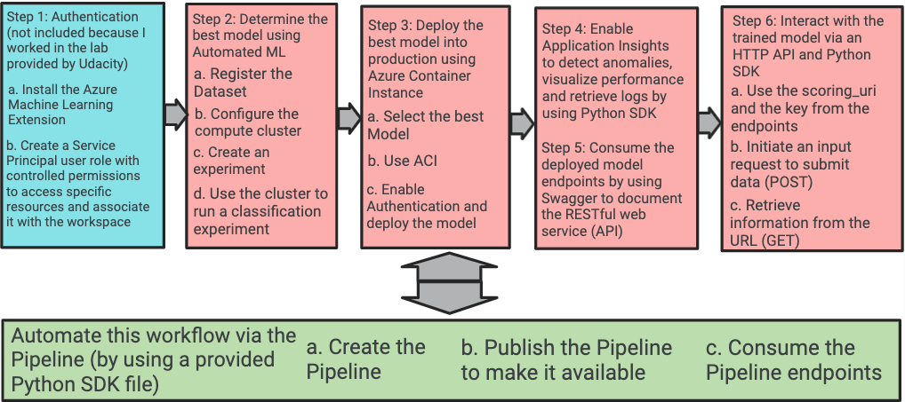
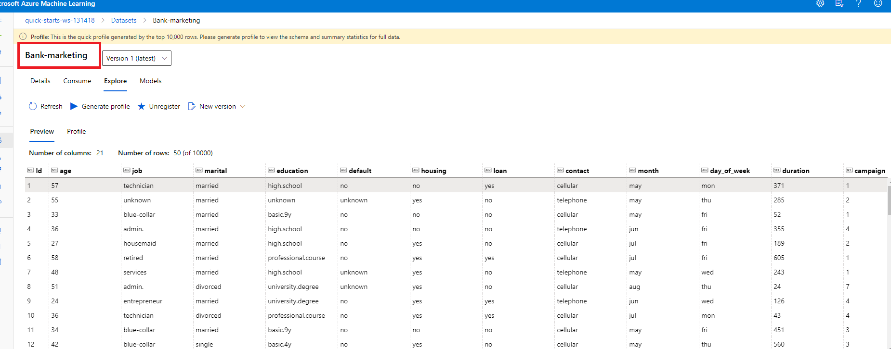
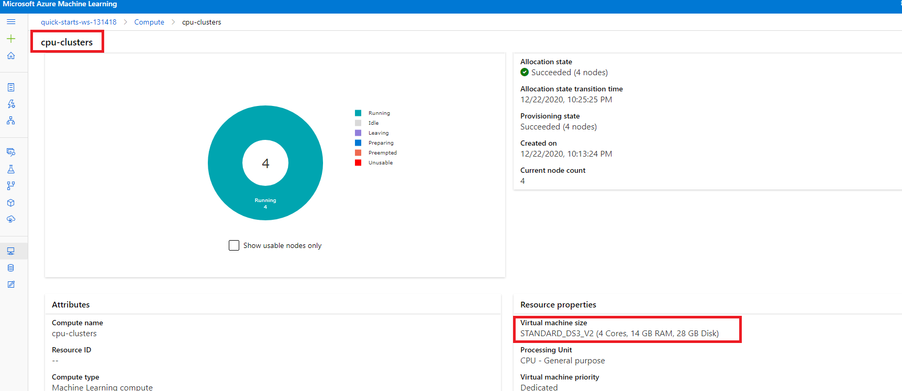
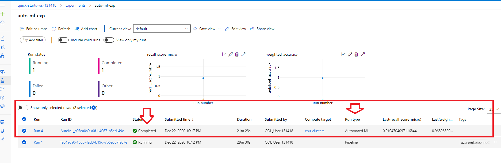
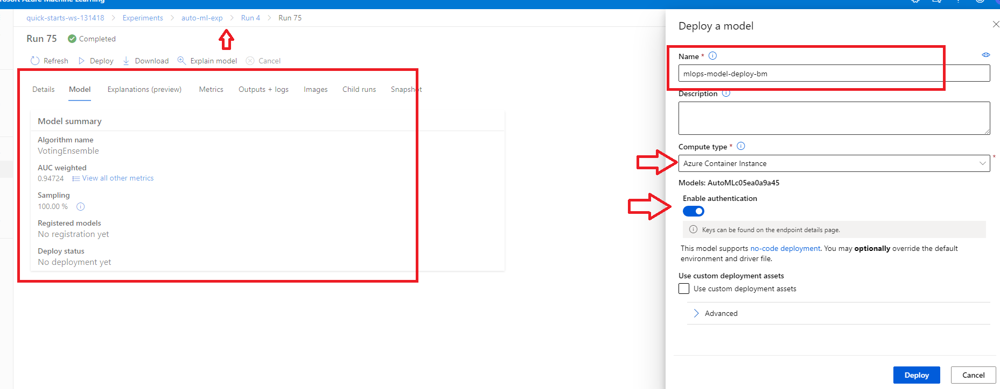
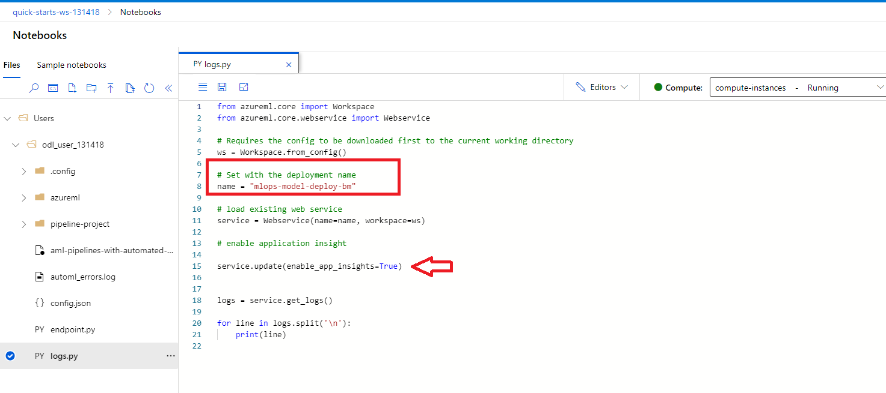

# Operationalizing Machine Learning in Azure

## Summary of the project

**This project is part of the Udacity Azure ML Nanodegree.**

The main object of this project is to predict if a client will subscribe to a term deposit product related to direct marketing campaigns of a Portuguese banking institution by creating a model and deploying it into production using Azure ML

Dataset: https://www.kaggle.com/henriqueyamahata/bank-marketing 

Where we apply MLOps principle by starting with the authenticating to Azure Machine Learning services, then the creation of an Automated ML experiment, the deployment of the best model, after that we enable the logging to review important log information, then we consume the model endpoint and finally we create and publish the pipeline to automate all this previous step.

## Architectural Diagram
The architectural diagram of the project with the main steps of each critical phase to the overall flow is described below:

## Key Steps
The key steps of the project are demonstrated bellow (screenshots included)

**Step 1: Authentication**  *Skipped because I used the provided Udacity Lab*

**Step 2: Create the Automated ML Experiment**

 1. Where we start first by the registration of the dataset into Azure ML Studio:
 
*Figure 1: Datasets/ Bank-marketing*

 2. We next create the compute cluster using Standard_DS3_V2 as the virtual Machine Size:

*Figure 2: Compute / cpu-clusters*

 3. We then configure and run the Automated ML Classification Experiment:
 
*Figure 3: Experiments / auto-ml-exp*

 4. To finally retrieve the Best Model after the experiment completed
 
*Figure 4: Experiments / auto-ml-exp / Run 4 (completed)*

**Step 3: Deploy the Best Model**

 1. Where we start by deploying the best Model from the previous Auto ML experiment by enabling Authentication and using Azure container instance (ACI)

*Figure 5: Experiments / auto-ml-exp / Run 4 (Run 75 deployment)*

 2. To finally create the endpoints after the deployment completed
 
*Figure 6: Endpoints /mlops-model-deploy-bm  (Healthy)*

**Step 4: Enable Application Insights to retrieve logs and visualize the performance**

 1. Where we start by modifying a provided logs.py by adding the name of the deployed model and enabling application insight 
 
*Figure 7: logs.py(Modification)*
 
 
  2. we then execute the logs.py file 
  
*Figure 8: logs.py(Execution)*
  
  
  3. To finally access to application insight  from the endpoints 
  
*Figure 9: Application insight*
 
 
 **Step 5: Consume the deployed model using Swagger**
 
  1. Where we start by downloading the swagger.json file associated with the deployed model endpoints and place it in the same folder as the swagger.sh and the server.py(Provided)
  
 *Figure 10: Swagger.json*
   
   
  2. We next execute the provided swagger.sh to download the latest container and lunch Swagger
  
 *Figure 11: Swagger default page*
   
   
  3. To finally display the API Documentation of the model 
  
 *Figure 12: Swagger documentation associated to the model endpoints*
   
   
 **Step 6: Consume the Model Endpoints**
 
  1. Where we start by modifying a provided endpoints.py by adding the scoring_uri and the key to match what was generated after the deployment
  
 *Figure 13: endpoint.py*
   
   
  2. To finally run the endpoint.py to interact with the trained model
  
 *Figure 14: Interaction with the model using endpoint.py*
   
   
   **Step 7: Create, Publish and Consume a Pipeline to automate all these previous steps in one python SDK**

  1. Where we used a provided aml-pipelines-with-automated-machine-learning-step.ipynb notebook
  
  2. we also download the config.json file and place it in the working directory
  
  3. And finally Run the different cells of the notebook to :
  
    . Create the pipeline
 
  *Figure 15: Pipeline creation (jupyter Notebook)*
  
  
  *Figure 16: Pipeline creation (azure ml studio)*
  
  
  *Figure 17: Pipeline run overview (azure ml studio)*
  
  
   *Figure 18: Pipeline experiments(azure ml studio)*
  
  
    . Create the Rest endpoint associated with the pipeline
    
   *Figure 19: Published pipeline overview*
 
   
 
## Screen Recording : https://www.youtube.com/watch?v=h1JAVnvP7-c&feature=youtu.be

## Standout Suggestions
The ability to use Python SDK to do various configurations in Azure ML is very interesting and my first attempt was to configure the automl run using python SDK (Automated ML Experiment (v0).ipynb) but unfortunately, I was not able to deploy the model after multiple attempts
   
*Figure 20 : deployment failed*

My suggestions for the future are associated with the AutoML step where we need first to fix the balancing problem which can lead to a falsely perceived positive effect of the model's accuracy, we need also next to give more time and even choose deep learning to the AutoML experiment to test more model and deliver a better result 
