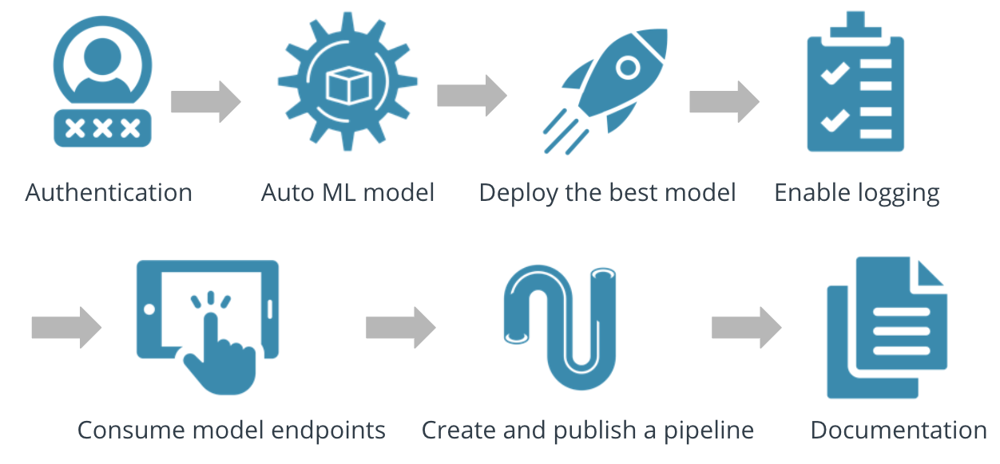

# Operationalizing Machine Learning in Azure

## Summary of the project
**This project is part of the Udacity Azure ML Nanodegree.**

The main object of this project is to predict if a client will subscribe to a term deposit product by using a dataset  (located here: https://www.kaggle.com/henriqueyamahata/bank-marketing ) related to direct marketing campaigns of a Portuguese banking institution by creating a model and deploying it into production using Azure ML

Where we apply Ml-Ops principle by starting  with the authenticating to Azure Machine Learning services, then the creation of an Automated ML experiment and the deployment of the best model , after that we enable the loging so that we can review important log information , then we consum the model endpoint and we finelly create and publish the pipeline to automate all this previous step

## Architectural Diagram
To describe more how this project was created you can find bellow the architectual diagram of the project with the main step of each phase that was critical to the overall flow :

## Key Steps
*TODO*: Write a short discription of the key steps. Remeber to include all the screenshots required to demonstrate key steps. 

## Screen Recording
*TODO* Provide a link to a screen recording of the project in action. Remember that the screencast should demonstrate:

## Standout Suggestions
*TODO (Optional):* This is where you can provide information about any standout suggestions that you have attempted.
