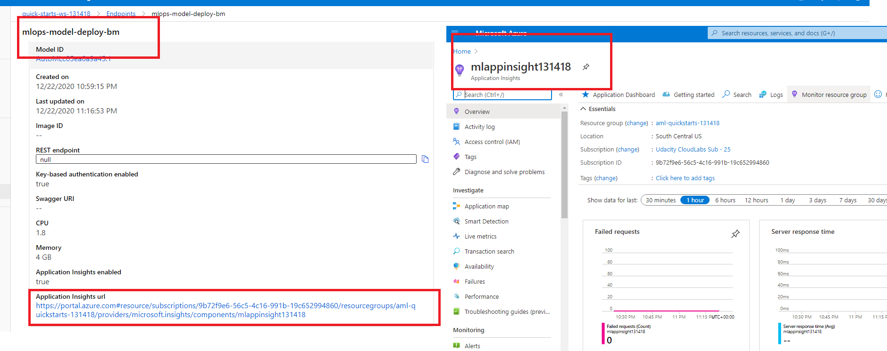
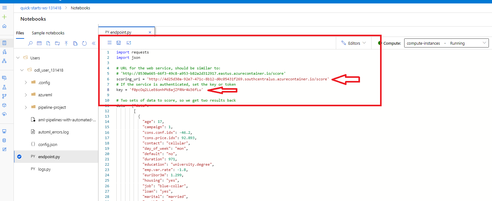

# Operationalizing Machine Learning in Azure

## Summary of the project

**This project is part of the Udacity Azure ML Nanodegree.**

The main object of this project is to predict if a client will subscribe to a term deposit product related to direct marketing campaigns of a Portuguese banking institution by creating a model and deploying it into production using Azure ML

Dataset: https://www.kaggle.com/henriqueyamahata/bank-marketing 

Where we apply MLOps principle by starting with the authenticating to Azure Machine Learning services, then the creation of an Automated ML experiment, the deployment of the best model, after that we enable the logging to review important log information, then we consume the model endpoint and finally we create and publish the pipeline to automate all this previous step.

## Architectural Diagram
The architectural diagram of the project with the main step of each critical phase to the overall flow is described below:

## Key Steps
The key steps of the project are demonstrated bellow (screenshots included)

**Step 1: Authentication**  *Skipped because I used the provided Udacity Lab*

**Step 2: Create the Automated ML Experiment**

 1. Where we start first by the registration of the dataset into Azure ML Studio:

 2. We next create the compute cluster using Standard_DS3_V2 as the virtual Machine Size:

 3. We then configure and run the Automated ML Classification Experiment:

 4. To finally retrieve the Best Model after the experiment completed

**Step 3: Deploy the Best Model**

 1. Where we deploy the best Model from the previous Auto ML experiment by enabling Authentication and using Azure container instance (ACI)

 2. To finally create the endpoints after the deployment completed

**Step 4: Enable Application Insights to retrieve logs. ab visualize the performance**

 1. Where we modify a provided logs.py by adding the name of the deployed model and enabling application insight 
 
 
 
  2. To finally access application insight 
  
 
 
 **Step 5: Consume the deployed model using Swagger**
 
  1. Where we start by downloading the swagger.json file associated with the deployed model endpoints and place it in the same folder as the swagger. sh and the server.py(Provided)
  
   
   
  2. We next execute the provided swagger. sh to download the latest container and lunch Swagger
  
   
   
  3. To finally display the API Documentation of the model 
  
   
   
 **Step 6: Consume the Model Endpoints**
 
  1. Where we modify a provided endpoints.py by adding the scoring_uri and the key to match the key for the service and the URI that was generated after deployment
  
   
   
  2. To finally run the endpoints.py to interact with the trained model
  
   

  
  

  
 

## Screen Recording
*TODO* Provide a link to a screen recording of the project in action. Remember that the screencast should demonstrate:

## Standout Suggestions
*TODO (Optional):* This is where you can provide information about any standout suggestions that you have attempted.
